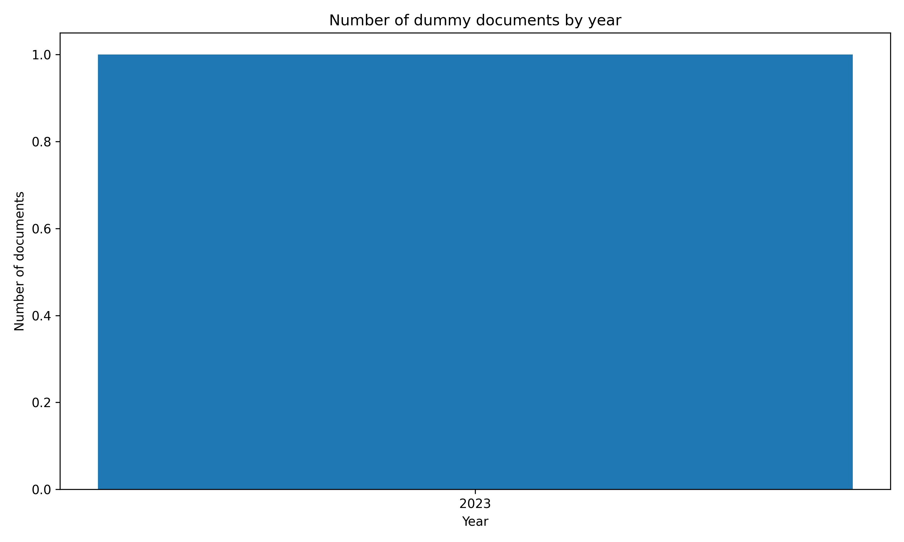

# Dummy

## Data Summary

|   |    |
| :-- | --: |
| Data Source | example.com |
| Date Range | 2023-10-01 to 2023-10-01 |
| Number of Docs | 1 |
| Number of Docs with PDFs | 0 |
| Dataset Size | 0.0GB |

## Document Metadata Example

```json
{
    "num": "1234567890",
    "date_str": "2023-10-01",
    "description": "Test Document",
    "url_pdf": "http://example.com/test.pdf",
    "url_metadata": "http://example.com/test.json"
}
```

[source data](None)

## Documents By Year



## 🤗 Hugging Face Datasets

- [nuuuwan/lk-docs-dummy-docs](https://huggingface.co/datasets/nuuuwan/lk-docs-dummy-docs)
- [nuuuwan/lk-docs-dummy-chunks](https://huggingface.co/datasets/nuuuwan/lk-docs-dummy-chunks)

## 20 Latest documents

- 2023-10-01 | `1234567890` | Test Document | [data](None)
